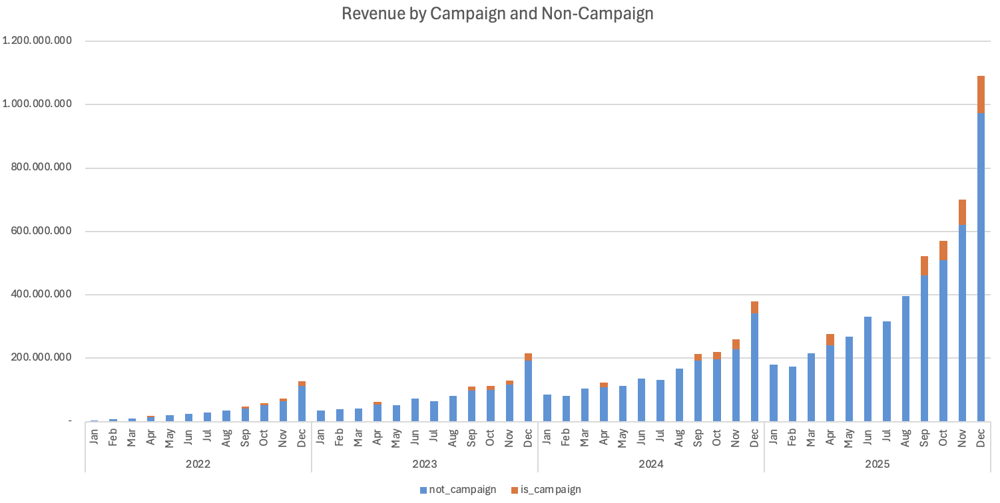
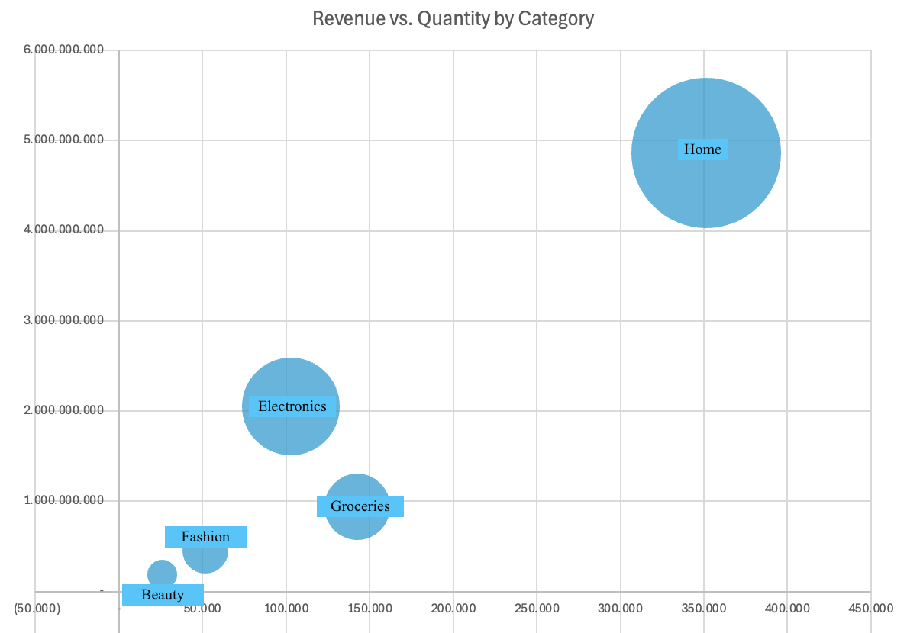
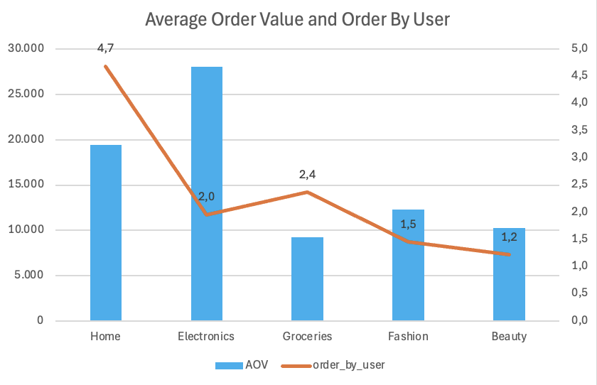
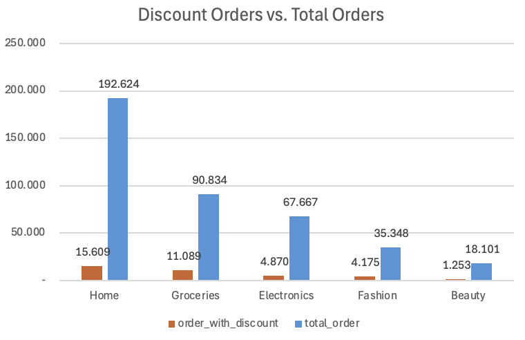
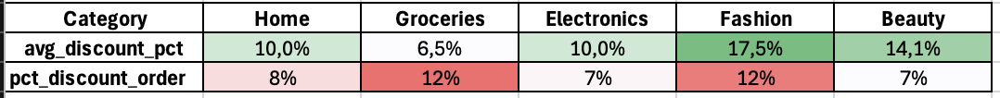
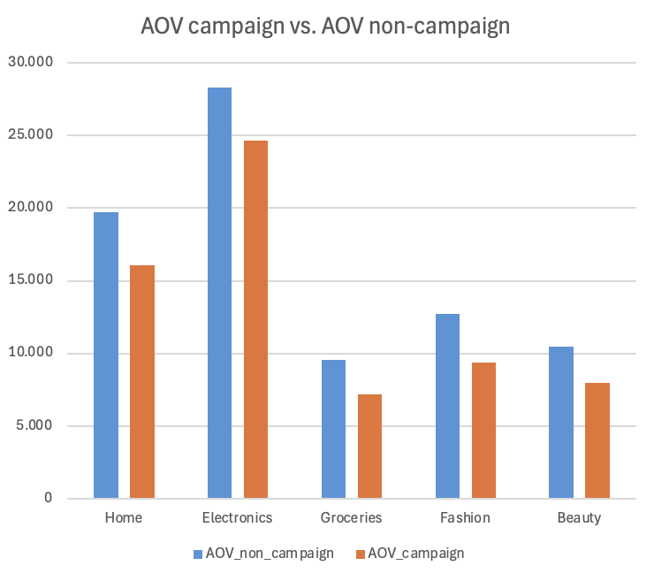
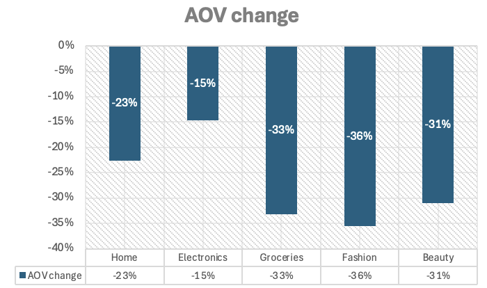

# Ecommerce-sales-analysis-sql-powerbi
Currency: THB
## Sales Revenue Analysis (2022-2025)

**1. Overall Trend: Strong Upward Growth**

Revenue shows a clear YoY acceleration
   - 2022: Low baseline, gradual buildup (peaks ~61M THB)
   - 2023: Moderate growth, first time crossing ~100M THB
   - 2024: Stronger scaling, peaks ~184M THB
   - 2025: Breakout year, reaching ~527M THB in December

The growth is exponential, especially from mid-2024 onwards.

**2. Breakout year - 2025**
- Monthly revenue in 2025 often exceeds peak months of prior years
- Q4 2025 alone contributes a massive share of total revenue
- The December spike (~527M THB) is ~3x higher than Dec 2024

## Insights Deep-Dive

### 1. Sales Performance

**Seasonal Pattern: Campaign-Driven Spikes**
- Revenue is heavily campaign-dependent and Q4 contributes disproportionately to annual revenue (especially in 2024–2025)
- Key spike periods are in April (Songkran) and Q3-Q4 campaigns 9.9, 10.10, 11.11, 12.12
- 12.12 is always the highest peak

**Baseline Revenue Increased Significantly YoY**
- Baseline (non-campaign) revenue has scaled substantially, growing from roughly 2M–100M in 2022 to 170M–900M in 2025. This suggests that the platform’s growth is not purely campaign-driven, but increasingly supported by strong and expanding organic demand.

**Key Takeaways of Sales Performance**
- 2025 is Breakout & Scale Year. Revenue growth accelerated sharply, especially in H2, with December hitting the highest level by far. The business has moved into high-growth phase
- Strong Seasonality is due to campaigns. Consistent spikes in: April (Songkran) and Q4 mega campaigns (9.9 → 12.12). A large portion of revenue depends on promotional events
- Improving Baseline Revenue while non-campaign months are rising significantly YoY. This indicates stronger brand, retention, and recurring demand

### 2. Category Performance

**Category Positioning**

Among 5 categories: 
- "Home" is dominant category, which contributes largest part of total revenue and sold quantity (20% category contributes more than 50% value). This category is main growth, revenue driver
- "Electronics" is with higher revenue, but lower volume. This is premium category with scaling potential in volume
- "Groceries" is with good traffic but low Value
- "Fashion" and "Beauty" are weak categories with low revenue and volume, despite very high average discount percentage applied (this data will be shown below).

**Customer Order Behavior by Category**

- "Home" category
  + Orders/user: 4.7 (highest)
  + AOV: mid (~19,000 THB)
  + Items/order: ~1.4 (no basket expansion)
    
→ Strong repeat behavior, customers trust & come back, but they buy only 1–2 items each time

- "Electronics" category:
  + AOV: highest (~28,000 THB)
  + Orders/user: 2.0 (low)
  + Items/order: ~1.4

→ Customers buy expensive items but rarely and no add-on behavior (should be higher than 1.4)

- "Groceries" category
  + Orders/user: 2.4
  + AOV: low (~9,000 THB)
  + Items/order: ~1.4 (should be much higher in groceries)

→ Customers come back sometimes, but buy very few items per trip

Key Issue: Across all 5 categories, basket size (items/order) remains really small at 1.4. This means customer only put 1-2 items in their order, regardless what items they bought 

### 3. Promotion-Driven:

**- Group 1: Efficient Discounts -  Home, Groceries**
  + Home: balanced discounting and response
  + Groceries: low discount depth, high usage
 → Discounts are working as expected; customers respond proportionally.
 → Strategy: Maintain current promo structure, optimize.

**- Group 2: Need Discounts to Drive Behavior - Fashion**
  + Highest avg discount (17.5%)
  + High discounted order share (12%)
→ Customers respond, but only when discounts are deep.
→ Strategy: Promotions are a key conversion lever; focus on smarter targeting rather than increasing discount further.

**- Group 3: Low Response Despite Discounts - Beauty, Electronics**
  + Beauty: high discount (14.1%) but low response (7%)
  + Electronics: moderate discount (10%) but low response (7%)
→ Discounts are not effectively driving incremental orders.
→ Strategy: Reassess promo effectiveness—could be wrong timing, targeting, or category inherently less promo-sensitive.

- Campaigns / Discount is reducing basket value across the board. Every category shows negative AOV impact, esecially in Fashion (-36%) and Groceries (-33%)
- Customers are likely buying cheaper substitutes, splitting orders instead of bundling (not in this case because item_per_order is still 1.4), focusing on promo-only items. Or campaign attracts lower-intent users so AOV drops even if conversion rises

**Recommendations**
- The discounts are encouraging “buy 1 cheap item” behavior, instead of “add more to save more” behavior. So, replace flat discount scheme with “Spend 10,000 THB → save 10%” or “Spend 20,000THB → save 15%”, which encourage customer spend more, add more
- Instead of discounting single items, we offer sets, bundled items, like Fashion → outfits, Beauty → skincare sets, Groceries → weekly packs
    
## Key Insights

**Insight 1. Strong Growth, but Campaign-Driven**
Revenue grows sharply (2022 → 2025), with extreme spikes in Q4 (up to ~527M THB).
→ Growth is still heavily dependent on campaigns drive, partly organic demand.

**Insight 2. No Basket Expansion**
Items per order stay flat (~1.4) across all categories.
→ Growth comes from more orders and higher prices, not larger baskets.

**Insight 3. Category Imbalance**
Home dominates revenue and engagement
Electronics = high value, low frequency
Fashion & Beauty = weak despite high discounts
Groceries = frequent but low value
→ Revenue is overly concentrated in one category.

**Insight 4. Promotions Reduce Efficiency**
Discounts boost conversion but consistently lower AOV (-33% to -36% in some categories).
→ Promotions drive volume, but hurt order value and ROI.

## Recommendations

- Action 1: Replace flat discounts with tiered spend incentives (e.g., spend 10,000 THB → save 10%)
- Action 2: Push bundles/sets to increase items per order (key fix: 1.4 flat AOV issue)
- Action 3: Increase Basket Size by adding cross-sell, “frequently bought together” functions in UX, and product-page bundling to drive multi-item purchases 
- Action 4:  Fix Category Imbalance (Revenue is over-reliant on Home) by improve ads, search ranking, and homepage visibility for weak categories (Beauty, Fashion)
- Action 5: Improve Repeat Usage by low-frequent order categories -Electronics, Groceries by add lifecycle triggers (reorder, accessories, upgrades) to increase repeat value
- Action 6: Users don’t naturally expand across products. So we need to improve recommendation engine, search relevance.

